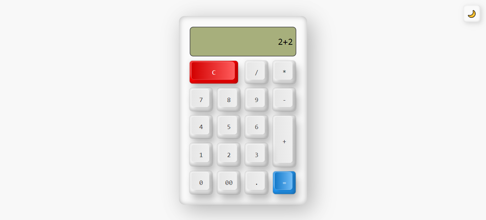

## ÍNDICE
* [1. Calculadora-3D](#1-Calculadora-3D)
* [2. Realización del Proyecto](#2-Realización-del-Proyecto)
* [3. Tecnologías Usadas](#3-Tecnologías-Usadas)
* [4. Autor ](#4-Autor )

***

  

  
  
  

# 1. Calculadora-3D

💻 Página web que simula la forma y funcionalidad básica de una calculadora tradicional, es decir, ' + ' ,  ' - ' ,  ' / '  y ' * '. 👨🏾‍🏫

***

# 2. Realización del Proyecto
## 2.1 Diseño 📱
### 2.1.1 Prototipo de baja Fidelidad: 📝

A la hora de definir qué contenidos irían en la página web, se realizó un prototipo aproximado de la distribución, con lápiz y papel.

### 2.1.2 Wireframe: 🙋🏼
Por lo tanto, en esta fase buscamos hacer un esquema de distribución virtual más detallado en Figma.

### 2.1.2 Prototipo de Alta Fidelidad: 💁🏼
Luego de tener el Wireframe, se realiza el diseño web en base a estilos, paleta de colores, entre otros recursos.

  
  

## 2.2 Resultado Final del Proyecto: 📱

A continuación se adjunta el [enlace para implementar el proyecto.](https://rjrch123.github.io/Calculadora-3D/)

***

# 3. Tecnologías Usadas 👩🏾‍💻
### 3.1 Para la estructura y diseño:
-   [HTML:](https://developer.mozilla.org/es/docs/Web/HTML)  Siguiendo las reglas del HTML semántico, se estructuró el proyecto.

-   [CSS:](https://developer.mozilla.org/es/docs/Web/CSS) Se utiliza para definir el estilo visual del proyecto.

-   [Figma:](https://www.figma.com) Plataforma para crear las estructuras prototipo (Wireframe, prototipo de alta fidelidad, maquetas).

***

# 4. Autor: 📍
-  [Rosamaria Rodriguez](https://github.com/RJRCH122)
